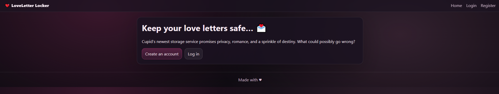
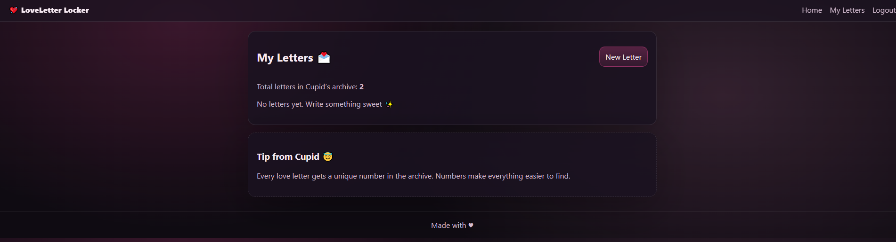
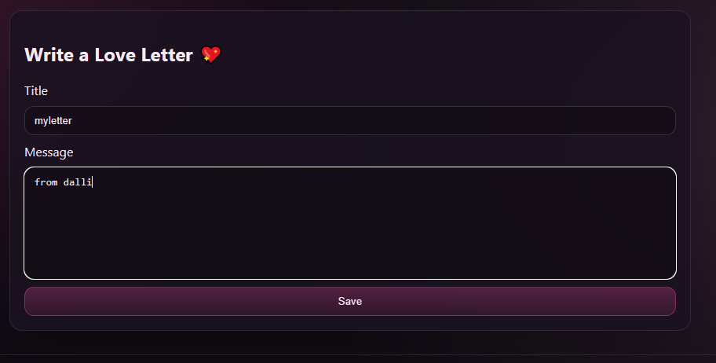
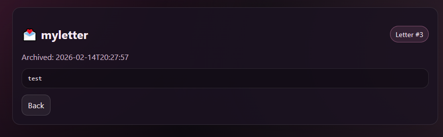
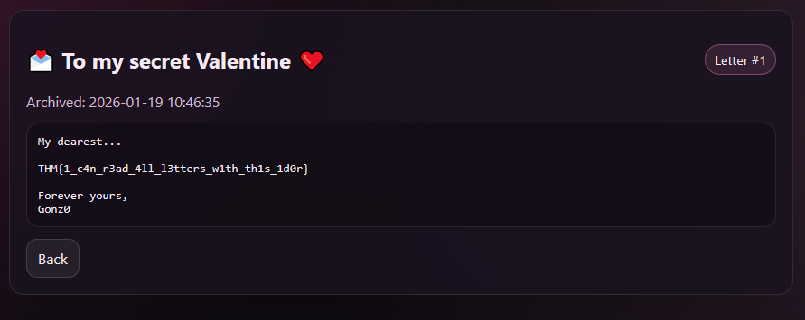

Target: http://10.81.174.34:5000/



We start by registering a new account and then logging in normally.



After logging in, we are able to send love letters through the application.



Once a letter is created, we can view it directly.



From the room description tip:

“from Cupid
Every love letter gets a unique number in the archive. Numbers make everything easier to find.”

This clearly suggests that each letter is stored with an incremental numeric ID. That means the application is referencing letters directly by their ID in the URL, which is a classic Insecure Direct Object Reference (IDOR) scenario.

Our created letter is accessible at:

```
http://10.81.174.34:5000/letter/3
```


Since the IDs are incremental, we can manually change the ID value in the URL. So instead of /letter/3, we try accessing /letter/1:

```
http://10.81.174.34:5000/letter/1
```




By directly requesting another object ID, we are able to access a letter that does not belong to us, specifically the admin’s letter, which contains the flag.

Attack Type: Insecure Direct Object Reference (IDOR) via predictable incremental object IDs without proper authorization checks.
