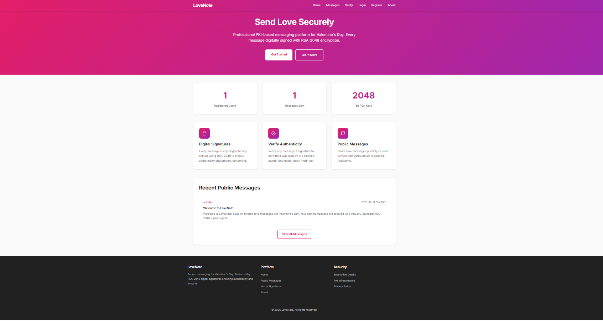
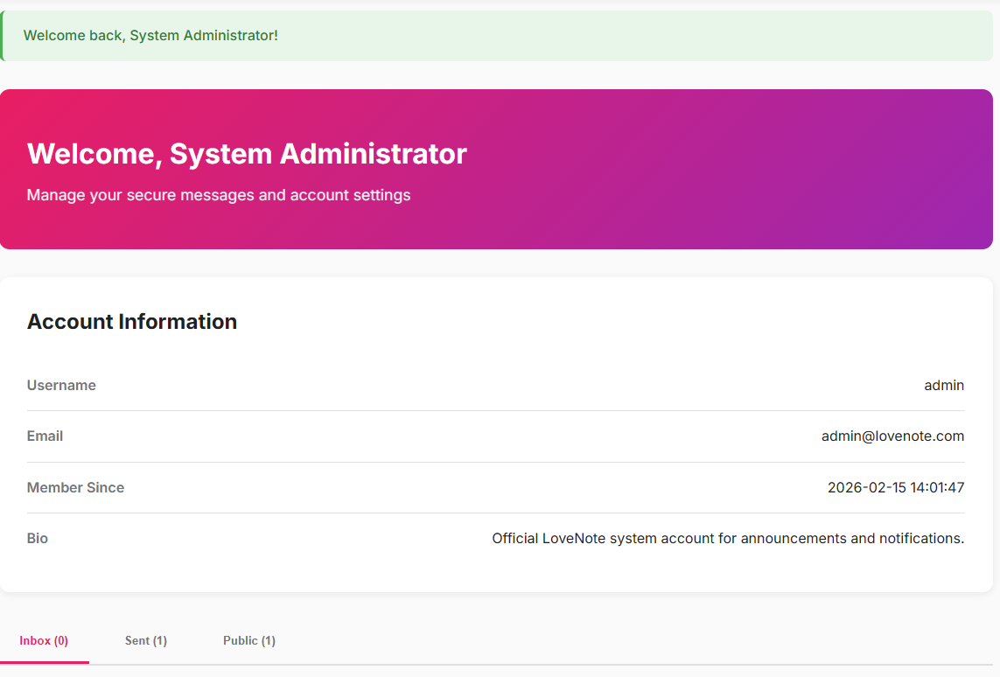
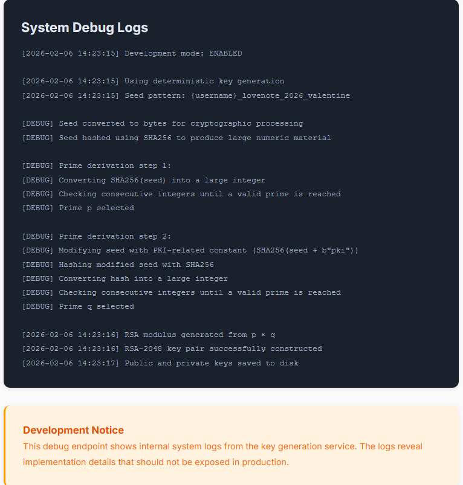
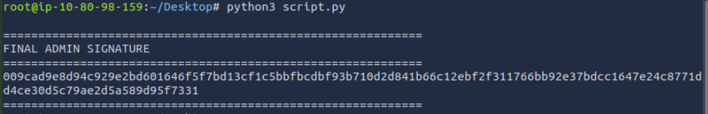
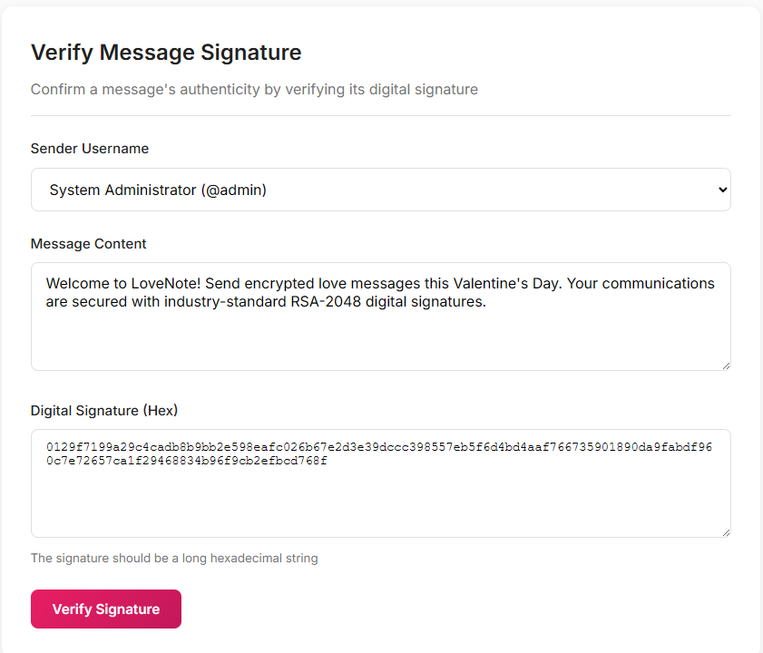
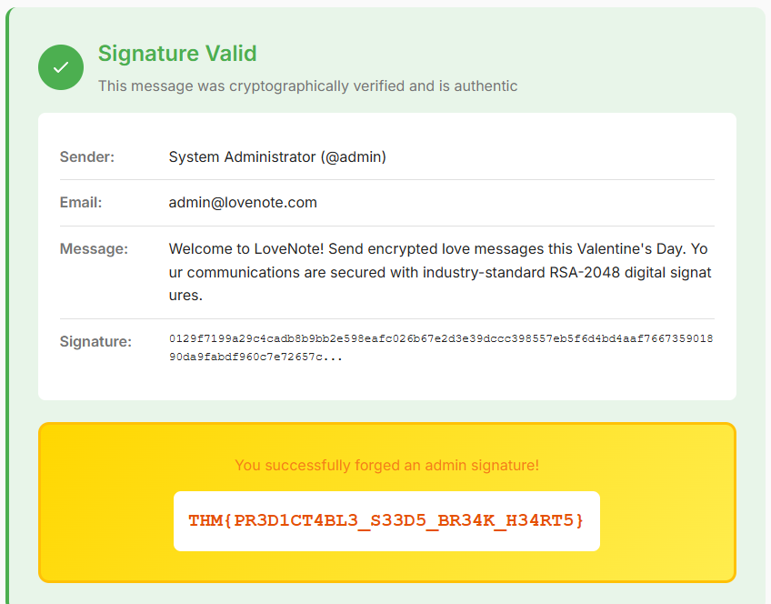

Target:
http://10.80.166.75:5000/



The login page does not require a password. Simply entering admin logs us in as admin.


After logging in, we can send messages or verify them.



Directory Enumeration
```
dirb http://10.80.166.75:5000/
```

```
-----------------
DIRB v2.22    
By The Dark Raver
-----------------

START_TIME: Sun Feb 15 14:05:21 2026
URL_BASE: http://10.80.166.75:5000/
WORDLIST_FILES: /usr/share/dirb/wordlists/common.txt

-----------------

GENERATED WORDS: 4612                                                          

---- Scanning URL: http://10.80.166.75:5000/ ----
+ http://10.80.166.75:5000/about (CODE:200|SIZE:15206)                         
+ http://10.80.166.75:5000/compose (CODE:302|SIZE:218)                         
+ http://10.80.166.75:5000/dashboard (CODE:302|SIZE:218)                       
+ http://10.80.166.75:5000/debug (CODE:200|SIZE:11342)                         
+ http://10.80.166.75:5000/login (CODE:200|SIZE:10999)                         
+ http://10.80.166.75:5000/logout (CODE:302|SIZE:208)                          
+ http://10.80.166.75:5000/messages (CODE:200|SIZE:12929)                      
+ http://10.80.166.75:5000/register (CODE:200|SIZE:12509)                      

-----------------
END_TIME: Sun Feb 15 14:05:30 2026
DOWNLOADED: 4612 - FOUND: 8
```


The interesting endpoint is:

http://10.80.166.75:5000/debug





The /debug page reveals how RSA keys are generated for each user in the backend:

- The key generation is deterministic and based on this seed pattern:

{username}_lovenote_2026_valentine


- From this seed:

seed → SHA256 → integer → nextprime() → p

seed + "pki" → SHA256 → integer → nextprime() → q

n = p × q

- So the RSA key pair is completely predictable from the username alone.

This means we can reconstruct the admin private key offline.

First install required dependencies:

```
pip3 install pycryptodome sympy
```


Then use this python script takes the username admin and its sent message that we found on the dashboard, then goes through the steps mentioned above to reconstruct the key pair and encrypt the message and sign it to get the signature:

```
import hashlib
from sympy import nextprime
from Crypto.PublicKey import RSA
from Crypto.Signature import pss
from Crypto.Hash import SHA256

TARGET_USER = "admin"

TARGET_MESSAGE = "Welcome to LoveNote! Send encrypted love messages this Valentine's Day. Your communications are secured with industry-standard RSA-2048 digital signatures."

def generate_key(username):
    seed = f"{username}_lovenote_2026_valentine".encode()
    p = nextprime(int(hashlib.sha256(seed).hexdigest(), 16))
    q = nextprime(int(hashlib.sha256(seed + b"pki").hexdigest(), 16))
    n = p * q
    e = 65537
    phi = (p - 1) * (q - 1)
    d = pow(e, -1, phi)
    return RSA.construct((n, e, d))

def sign_message(key, message):
    h = SHA256.new(message.encode())
    modBits = key.size_in_bits()
    emLen = (modBits - 1 + 7) // 8
    maxSalt = emLen - h.digest_size - 2
    if maxSalt < 0:
        raise ValueError("Invalid key size")
    signer = pss.new(key, salt_bytes=maxSalt)
    signature = signer.sign(h)
    return signature.hex()

def main():
    key = generate_key(TARGET_USER)
    signature = sign_message(key, TARGET_MESSAGE)
    print("\n" + "="*60)
    print("FINAL ADMIN SIGNATURE")
    print("="*60)
    print(signature)
    print("="*60)

if __name__ == "__main__":
    main()
```


Run the script from the attackbox:



The script outputs a valid RSA-PSS signature generated using the reconstructed admin private key.


We take the generated signature and submit it to verify the already shared admin message.



The system confirms it is a valid signature and reveals the flag.



Attack Type: Cryptographic vulnerability due to deterministic RSA key generation based solely on predictable username-derived seed, allowing full private key reconstruction and signature forgery.
