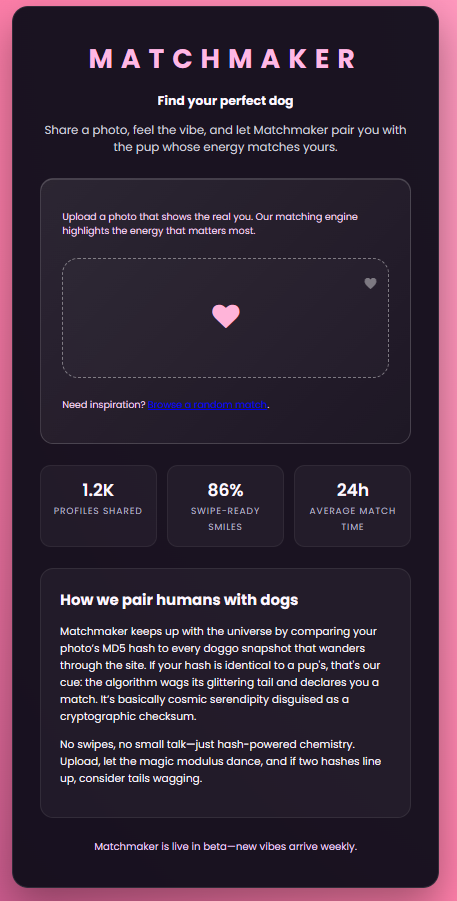
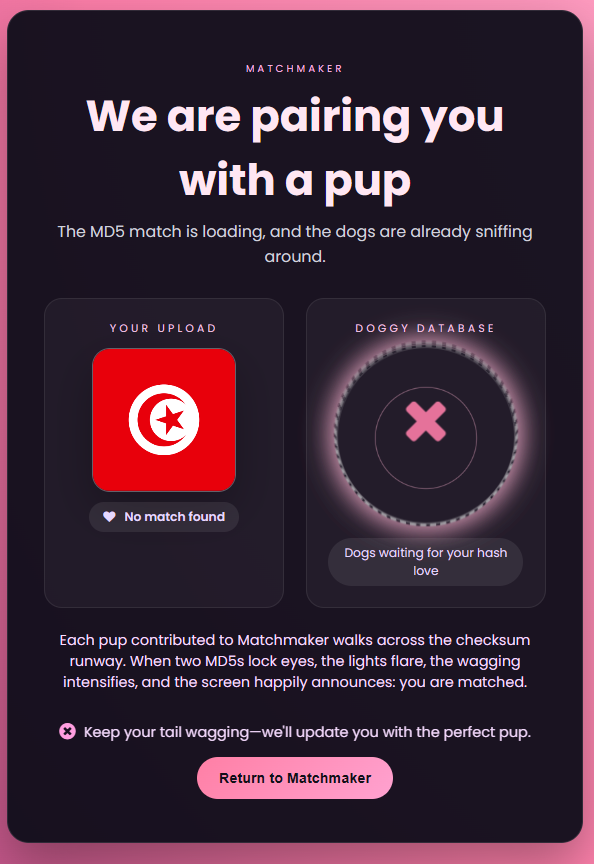
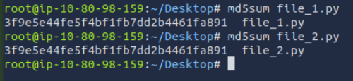
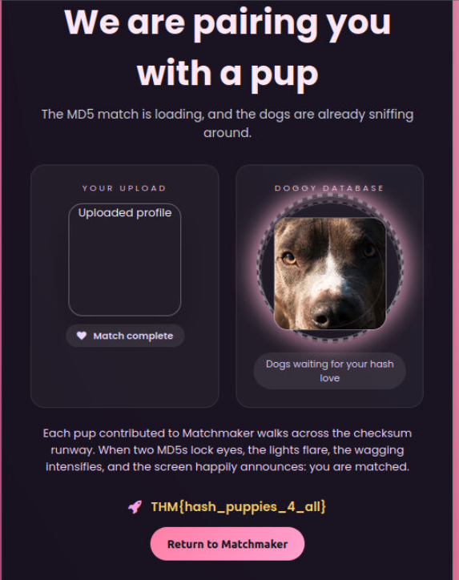

Target: http://10.80.174.51/



Going through the website, all the descriptions and hints strongly suggest this challenge is related to MD5 collisions.

So I started by uploading a normal photo.



The response was:

"No match found"


I tried uploading different file types as well and they were accepted, but always same no match found result.


At first, I considered brute-forcing a hash to match an existing file on the server, but realistically that is not feasible.

I re-uploaded the same image again, thinking maybe it would compare against the already stored file and produce a match


Interesting response, so each upload (even duplicates) gets a unique UUID. Here are some examples of the uploaded files:

```
http://10.80.174.51/view/6f4925bf-5f48-4144-adb0-de5cab8d2dd7
http://10.80.174.51/view/dee0e503-c7e8-41c0-b7f0-d7f668fafcd0
```


Both were the exact same image, but assigned different UUIDs. However, they were marked internally as repeated files.

This confirms the server is hashing file contents (likely MD5) and comparing hashes to detect duplicates.


The correct approach is to upload two different files that produce the same MD5 hash.

I found a ready-made example of colliding files that share the same MD5:

https://github.com/sergeyfrolov/multiple_md5_collisions/tree/master/examples

From there, I used:

file_1.py & file_2.py


These two files:

Have different content yet produce the same MD5 hash




Upload file_1.py gets us a No match found.

Upload file_2.py the application detects a “match”, since it has the same MD5 as file_1.py that is now stored on the server.



At this point, the server recognizes the hash collision and returns the flag.

Attack Type: MD5 hash collision exploitation due to insecure use of MD5 for file uniqueness validation.
